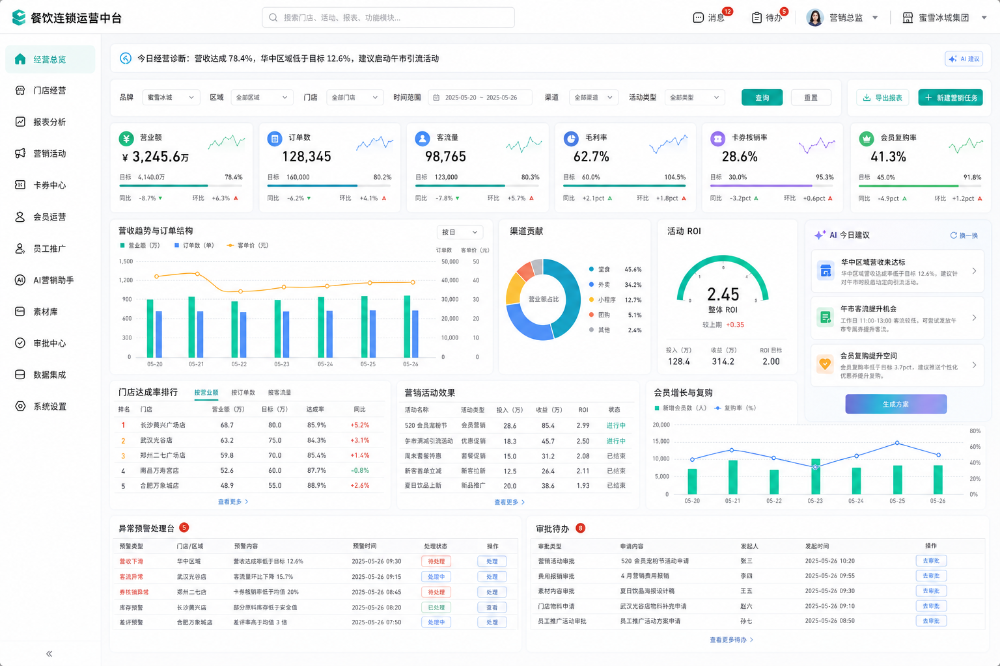
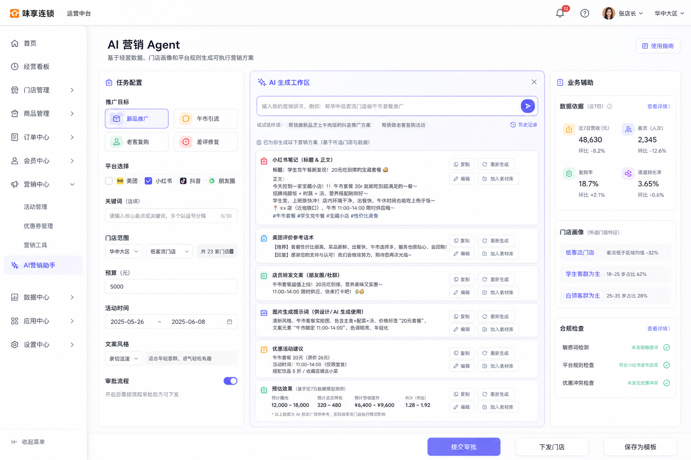
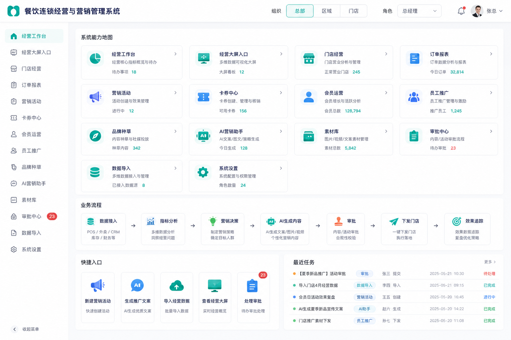
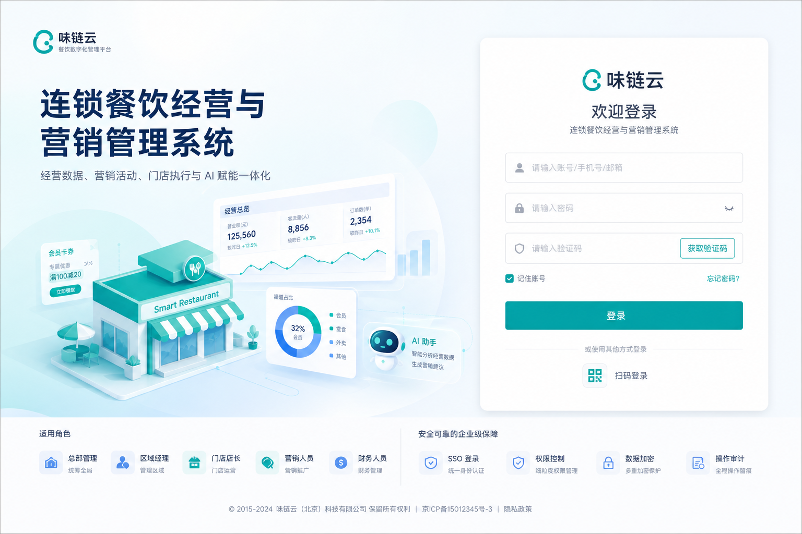
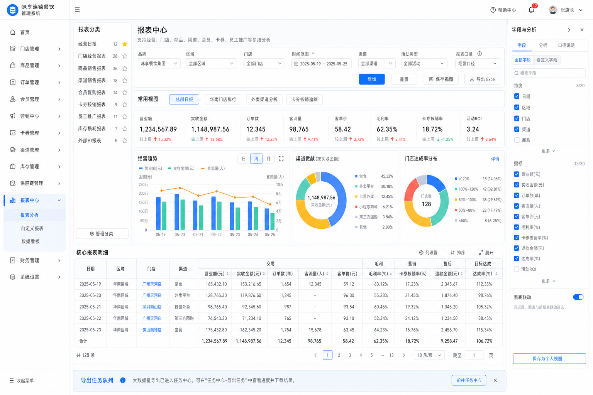
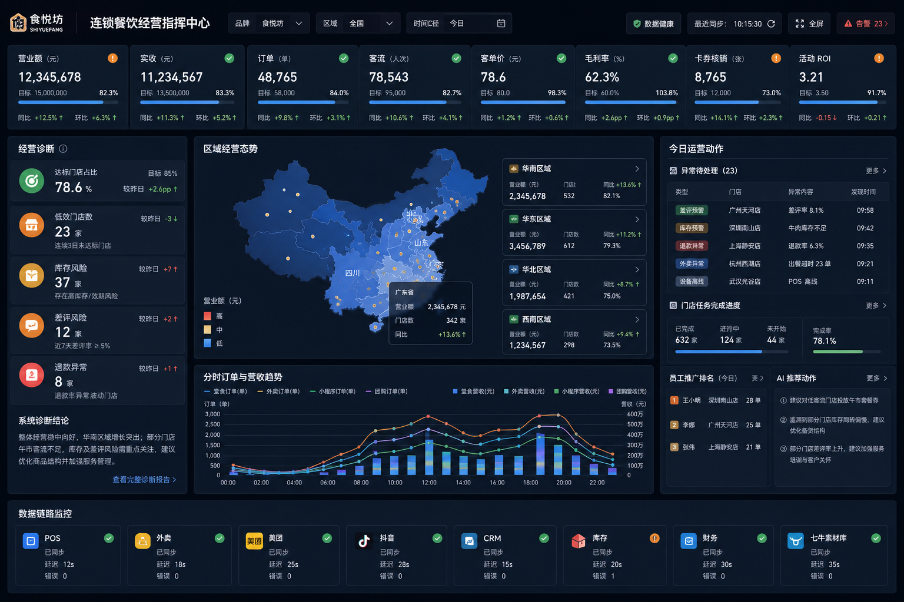

# 餐饮连锁运营平台产品与设计方案

## 1. 项目名称

- 中文名：餐饮连锁运营平台
- 英文名：Dining Ops Platform
- Git 项目名：dining-ops-platform

## 2. 项目定位

Dining Ops Platform 是一个面向连锁餐饮企业总部、区域、门店、营销、财务和运营人员的 B 端运营平台。

从求职和学习角度看，它同时也是一个用于补强现代前端能力的综合实践项目，重点覆盖：

- Vue3 + TypeScript 企业级中后台。
- Element Plus 后台系统。
- 原生报表中心。
- ECharts 大屏和地图。
- SVG / Canvas / D3 / X6 可视化能力。
- Three.js / Cesium 3D 地图能力。
- WebSocket / MQTT 实时数据。
- AI 营销 Agent。
- AI Coding 工作流。
- Electron 桌面端扩展。

系统不只是一个数据大屏，也不是单一 CRM 后台，而是围绕餐饮连锁经营形成完整闭环：

```text
数据接入
→ 经营分析
→ 报表下钻
→ 大屏展示
→ 地图态势定位
→ AI 生成营销动作
→ 审批
→ 下发门店
→ 执行反馈
→ 数据回流复盘
```

## 3. 目标用户

- 总部管理者：看整体经营情况、区域排名、门店异常、经营目标达成。
- 营销人员：创建活动、分析活动 ROI、生成推广内容、下发门店。
- 区域经理：查看区域门店达成率、异常门店、任务执行情况。
- 店长：查看本店经营、任务、卡券核销、员工推广结果。
- 财务人员：关注实收、退款、卡券核销、成本、毛利和导出报表。
- 运营人员：处理异常预警、审批待办、库存风险和门店执行反馈。

## 4. 页面体系

系统采用两套视觉和布局体系：

```text
后台管理系统：浅色企业后台风格
经营大屏：深色全屏展示风格
```

推荐路由结构：

```text
/login                 登录页
/overview              系统总览
/dashboard             经营工作台
/reports               报表中心
/large-screen          经营指挥大屏
/geo-visualization     地图态势 / 3D 可视化
/visualization-lab     可视化实验室
/workflow-designer     流程设计器
/marketing             营销活动
/coupons               卡券中心
/members               会员运营
/staff-promotion       员工推广
/ai-agent              AI 营销 Agent
/materials             素材库
/approval              审批中心
/data-import           数据导入
/performance-lab       性能优化实验室
/ai-coding             AI Coding 过程沉淀
/settings              系统设置
```

## 5. 登录页设计

登录页采用浅色企业 SaaS 风格，主色为青绿色和深蓝。

页面结构：

- 左侧：品牌视觉区，展示门店、数据图表、会员卡券和 AI 助手插画。
- 右侧：登录卡片，包含账号、密码、验证码、扫码登录。
- 底部：展示 SSO 登录、权限控制、数据加密、操作审计等安全能力。

登录页要表达：

- 这是餐饮行业系统。
- 这是经营、营销、门店执行和 AI 赋能一体化平台。
- 这是企业级后台，不是营销官网。

## 6. 系统总览页设计

系统总览页用于展示整个平台的能力地图和业务闭环。

主要模块：

- 经营工作台
- 经营大屏入口
- 可视化实验室
- 地图态势 / 3D 可视化
- 审批流 / 营销任务流设计器
- 门店经营
- 订单报表
- 营销活动
- 卡券中心
- 会员运营
- 员工推广
- 品牌种草
- AI 营销助手
- 素材库
- 审批中心
- 数据导入
- 性能优化实验室
- AI Coding 过程沉淀
- 系统设置

核心设计目标：

- 让用户知道系统能做什么。
- 让面试时可以清楚讲出系统边界。
- 让后续开发模块有明确入口。
- 让学习项目中的技术补强点有清晰入口，避免可视化、AI、Electron 等能力变成孤立 Demo。

## 7. 经营工作台 Dashboard 设计

经营工作台是后台系统首页，适合长期操作，不使用深色大屏风格。

视觉风格：

- 左侧白色导航。
- 顶部白色导航栏。
- 内容区浅灰背景。
- 卡片白色。
- 主色青绿色。
- AI 相关区域使用轻微蓝紫渐变点缀，但不突兀。

核心模块：

- 今日经营诊断
- 品牌 / 区域 / 门店 / 时间 / 渠道 / 活动类型筛选
- KPI 卡片：营业额、订单数、客流量、毛利率、卡券核销率、会员复购率
- 营收趋势与订单结构
- 渠道贡献
- 活动 ROI
- 门店达成率排行
- 营销活动效果
- 会员增长与复购
- 异常预警处理台
- 审批待办
- AI 今日建议

核心交互：

- 切换品牌、区域、门店、时间后刷新工作台数据。
- 点击门店排行进入门店经营报表。
- 点击异常预警进入异常处理或报表详情。
- 点击 AI 建议进入 AI 营销 Agent 生成方案。
- 支持导出当前工作台关键数据。

## 8. 报表中心设计

报表中心采用原生 Vue 页面，不采用 iframe 嵌套 H5 报表作为主方案。

设计目标：

- 统一系统交互。
- 统一权限、筛选、路由、导出、字段配置。
- 支持报表下钻和常用视图保存。
- 兼容外部 BI 报表作为历史系统兜底。

页面结构：

```text
左侧：报表分类树
顶部：统一筛选器
中间：指标卡 + 图表分析 + 明细表
右侧：字段与分析抽屉
底部：分页 + 导出任务提示
```

报表分类：

- 经营日报
- 门店经营报表
- 商品销售报表
- 渠道销售报表
- 会员复购报表
- 卡券核销报表
- 员工推广报表
- 库存损耗报表
- 外部 BI 报表

关键能力：

- 查询条件记忆。
- 保存常用视图。
- 字段显示配置。
- 表格列排序、筛选、冻结、合计。
- 点击门店、商品、渠道、活动下钻。
- 大数据量导出进入导出任务队列。
- 报表权限控制。
- 敏感报表水印。

## 9. 经营指挥大屏设计

经营指挥大屏用于投屏展示，不走后台 Layout。

页面路径：

```text
/large-screen
```

适配策略：

- 设计稿基准 1920 x 1080。
- 主内容等比 scale。
- 背景层 100vw x 100vh 铺满。
- 核心内容放在 16:9 安全区。
- 非标准比例屏幕用背景纹理和光效填充。

核心模块：

- 顶部：品牌、区域、时间口径、数据健康状态、同步时间、全屏按钮、告警数。
- KPI 通栏：营业额、实收、订单、客流、客单价、毛利率、卡券核销、活动 ROI。
- 左侧：经营诊断、低效门店、库存风险、差评风险、退款异常。
- 中间：区域经营态势地图、区域热力、门店点位、飞线、区域经营卡片。
- 下方：分时订单与营收趋势。
- 右侧：今日运营动作、异常待处理、门店任务进度、员工推广排名、AI 推荐动作。
- 底部：POS、外卖、美团、抖音、CRM、库存、财务、素材库等数据链路监控。

大屏交互原则：

- 大屏以展示为主，交互为辅。
- 支持点击区域、门店、异常进入报表中心。
- 支持全屏展示。
- 支持定时刷新或实时推送。

## 10. 地图与 3D 可视化设计

地图可视化建议分阶段实现：

第一阶段：ECharts 地图

- 中国 / 省市 GeoJSON。
- 区域热力。
- 门店点位。
- 订单飞线。
- 点击区域下钻报表。

第二阶段：地图 SDK

- 高德地图或 Mapbox。
- 真实经纬度门店。
- 点位聚合。
- 热力图。
- 区域边界。

第三阶段：Cesium 3D

- 3D 地球或城市视图。
- 门店 3D 点位。
- 区域柱状体。
- 订单流向线。
- 点击门店展示经营浮层。

定位：

- ECharts 地图用于业务看板和大屏。
- Cesium 用于高级地理空间可视化学习和展示。
- 不强行把 Cesium 放进所有页面，避免业务过重。

## 11. 可视化实验室设计

页面路径：

```text
/visualization-lab
```

定位：

可视化实验室不是普通业务页面，而是用于集中展示前端可视化能力的学习与作品模块。

它需要服务招聘中常见的这些关键词：

- SVG
- Canvas
- D3.js
- X6
- Three.js
- WebGL
- 大量数据可视化
- 性能优化

建议子模块：

- ECharts 图表案例：经营趋势、渠道分析、排行、热力图。
- Canvas 大量点位：模拟大量门店、订单点位和轨迹渲染。
- SVG / D3 自定义图表：会员分层、渠道漏斗、组织结构、关系图。
- X6 流程图：审批流、AI 营销任务流、数据接入链路。
- Three.js 基础 3D：3D 门店卡片、场景、光照和动画。
- Cesium 地图入口：跳转到 3D 地理态势页面。

设计原则：

- 每个实验都要有业务解释，不做无意义炫技。
- 每个实验都要能在面试中讲清楚技术选择。
- 可视化实验室可以作为作品集展示入口。

## 12. 流程设计器设计

页面路径：

```text
/workflow-designer
```

定位：

用于展示 X6 / SVG 相关能力，结合餐饮业务里的审批流、营销任务流和数据链路。

业务场景：

- 营销活动审批流。
- AI 内容生成后的审批和下发流程。
- 门店任务执行流程。
- 数据接入链路：POS / 外卖 / CRM / 库存 / 财务 → 指标中心 → 报表 / 大屏。

核心能力：

- 节点拖拽。
- 节点连线。
- 节点配置面板。
- 流程预览。
- 流程 JSON 保存。
- 流程状态展示。

面试价值：

- 体现复杂组件能力。
- 体现 SVG / X6 可视化能力。
- 体现业务流程抽象能力。

## 13. 性能优化实验室设计

页面路径：

```text
/performance-lab
```

定位：

用于沉淀项目中的性能优化案例，避免简历中只写“做过性能优化”但面试讲不清。

建议案例：

- 大表格服务端分页和虚拟滚动对比。
- ECharts 实例复用和重复初始化对比。
- ResizeObserver 防抖。
- Excel 大文件主线程解析与 Web Worker 解析对比。
- Canvas 大量点位与 DOM 点位渲染对比。
- Cesium 点位聚合和分层加载。
- 路由懒加载和构建产物分析。

核心设计：

- 每个优化案例都展示优化前、优化后、耗时、帧率、内存或用户体验差异。
- 页面中保留说明区域，方便后续写面试话术。

## 14. AI Coding 过程沉淀设计

页面路径：

```text
/ai-coding
```

定位：

用于记录本项目如何使用 AI 辅助开发，呼应招聘中的 AI Coding 加分项。

内容结构：

- 需求拆解记录。
- 模块设计 Prompt。
- 代码生成 Prompt。
- 代码审查记录。
- Bug 修复记录。
- 重构优化记录。
- 面试问答生成记录。

设计原则：

- 不只是保存聊天记录，而是沉淀可复用方法论。
- 记录“人工如何约束 AI”，而不是“让 AI 随便生成”。
- 每个阶段有输入、输出、验收标准。

## 15. AI 营销 Agent 设计

AI 营销 Agent 是营销人员的业务助手，不是单纯聊天框。

核心链路：

```text
输入推广目标和关键词
→ 选择平台和门店范围
→ AI 生成文案、图片提示词、推广方案
→ 保存素材库
→ 提交审批
→ 下发门店
→ 门店执行
→ 效果追踪
```

页面结构：

- 左侧：任务配置
  - 推广目标
  - 平台选择
  - 关键词
  - 门店范围
  - 预算
  - 活动时间
  - 文案风格
  - 审批流程开关
- 中间：AI 生成工作区
  - 对话式输入框
  - 小红书笔记
  - 美团评价话术
  - 店员转发文案
  - 图片生成提示词
  - 优惠活动建议
  - 预估效果
- 右侧：业务辅助面板
  - 近 7 日营收
  - 客流
  - 复购率
  - 渠道转化
  - 门店画像
  - 合规检查

AI 要突出赋能，但视觉上要与后台系统协调。

## 16. 设计图资产

当前方案参考图：

- Dashboard 浅色版：



- AI 营销 Agent：



- 系统总览：



- 登录页：



- 原生报表中心：



- 经营指挥大屏：



这些设计图用于确定方向，后续开发时应以文档中的业务结构和交互说明为准。

## 17. 实现状态（截至 Phase 18）

产品与路由设计包含比当前实现更多的业务模块；**第 1–18 阶段仅实现学习主线所需路由**，其余为扩展位。

**已实现（14 条路由）**：

```text
/login  /dashboard  /reports  /large-screen  /geo-visualization  /geo-3d
/visualization-lab  /workflow-designer  /realtime-monitor  /ai-agent
/data-import  /approval  /performance-lab  /ai-coding
```

**规划中、尚未实现**：

```text
/overview  /marketing  /coupons  /members  /staff-promotion  /materials  /settings
```

**与设计的已知差异**：

- 源码当前为 **JavaScript**（TypeScript 见架构文档渐进策略）。
- 数据层为 **Mock**，未接 Axios 与真实后端。
- 登录页验证码 / 扫码为 UI 占位。
- 报表明细采用服务端分页；虚拟滚动在 `/performance-lab` 演示。

完整分阶段自检、联动验证清单与测试账号见 **[docs/10-phase-completion-audit.md](./10-phase-completion-audit.md)**。
