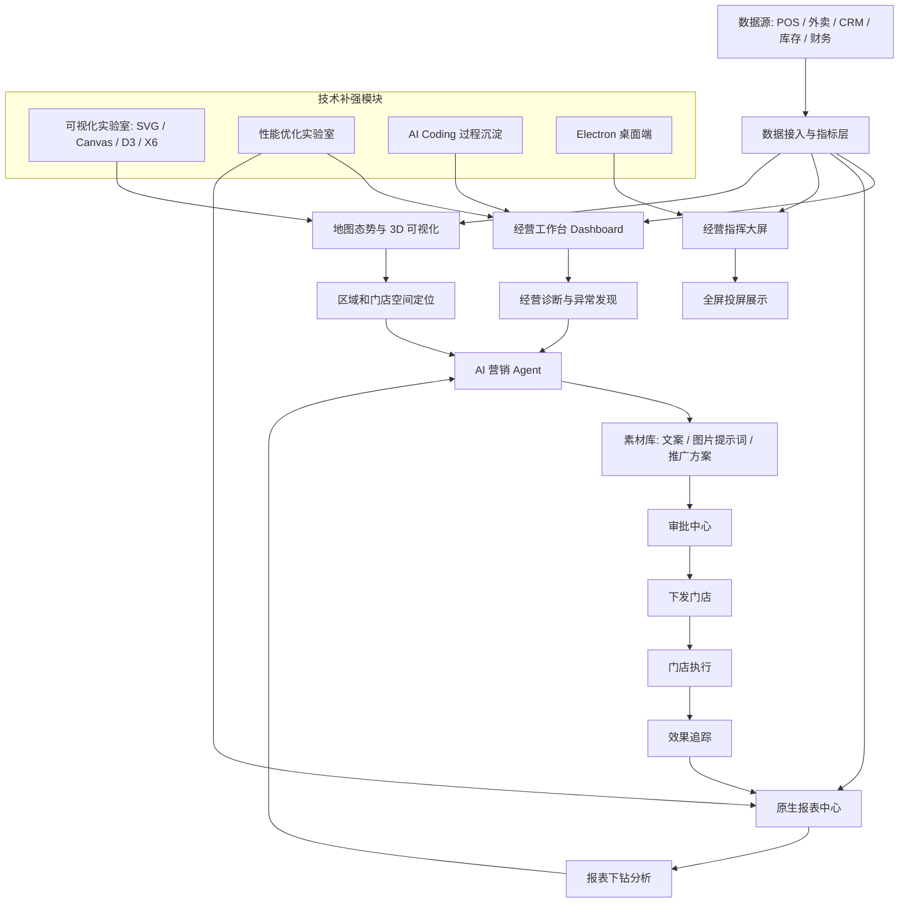

# 项目总览、学习路线评估与 AI 使用方式

## 1. 项目是否符合当前招聘市场

结论：符合，而且方向正确。

当前前端招聘对高级前端的要求已经从“会写页面”转向：

- 能独立理解业务和落地复杂系统。
- 能搭建 Vue3 / React 企业级项目。
- 能做组件抽象和工程化。
- 能做报表、Dashboard、大屏和数据可视化。
- 了解 SVG、Canvas、WebGL、D3、Three.js、Cesium 等绘图能力。
- 有前端性能优化经验。
- 能使用 AI Coding 工具提升交付效率。

Dining Ops Platform 覆盖了这些要求：

```text
Vue3 企业中后台
+ 原生报表中心
+ ECharts 大屏
+ 地图 / 3D 可视化
+ SVG / Canvas / D3 / X6
+ WebSocket / MQTT
+ AI 营销 Agent
+ 性能优化专题
+ AI Coding 工作流
+ Electron 桌面端
```

## 2. 是否能补全当前弱势

你的真实经历优势：

- Vue2。
- 移动端 H5。
- uni-app 小程序。
- 餐饮业务。
- 组件库。
- JSBridge SDK。
- CRM / PC 管理系统。
- WebSocket / MQTT 实战。

这个项目补强短板：

- Vue3 + TypeScript。
- Element Plus 企业后台。
- 原生报表中心。
- 大屏和 ECharts。
- SVG / Canvas / D3 / X6。
- Three.js / Cesium。
- 大量数据可视化和性能优化。
- AI Agent。
- AI Coding。
- Electron。

所以这个项目对找工作有帮助，但前提是：不能只让 AI 生成代码，你必须理解每个阶段的技术选择和面试讲法。

## 3. 功能模块总览

业务模块：

- 登录页。
- 系统总览。
- 经营工作台 Dashboard。
- 报表中心。
- 经营指挥大屏。
- 门店经营。
- 营销活动。
- 卡券中心。
- 会员运营。
- 员工推广。
- 素材库。
- 审批中心。
- 数据导入。

技术补强模块：

- 可视化实验室。
- 流程设计器。
- 地图态势 / 3D 可视化。
- 性能优化实验室。
- AI Coding 过程沉淀。
- Electron 桌面端。

## 4. 技术栈总览

主栈：

```text
Vue3
Vite
TypeScript
Vue Router
Pinia
Element Plus
ECharts
Axios
```

扩展栈：

```text
Element Plus Table V2 / vxe-table
xlsx
Web Worker
WebSocket
MQTT.js
SVG
Canvas
D3.js
X6
Three.js
WebGL
Cesium
AI Agent
AI Coding
Electron
```

## 5. 推荐开发步骤

```text
1. 项目初始化
2. 登录页
3. 后台 Layout
4. 路由和 Pinia 持久化
5. Dashboard
6. 报表中心
7. ECharts 封装
8. 经营大屏
9. ECharts 地图
10. SVG / Canvas 可视化增强
11. D3 / X6 流程和关系可视化
12. WebSocket / MQTT
13. AI 营销 Agent
14. 数据导入导出
15. 权限和审批
16. Three.js / Cesium
17. 可视化性能优化专题
18. AI Coding 工作流沉淀
19. Electron
```

这个顺序合理，因为：

- 先打 Vue3 B 端基础。
- 再做报表和图表。
- 再做大屏和地图。
- 再补可视化高级能力。
- 再接 AI 和实时数据。
- 最后做 Electron。

不建议一开始做 Cesium、Electron 或 AI，因为它们依赖主系统结构。

## 6. 每个阶段如何让 AI 帮你做

通用提示词：

```text
按 Dining Ops Platform 项目规则，开始第 X 阶段：[阶段名称]。

要求：
1. 先阅读 README.md 和 docs 中相关文档。
2. 只实现当前阶段，不提前实现后续模块。
3. 使用 Vue3 + Element Plus + Pinia + Vue Router（当前实践版为 JavaScript，见 docs/10 §5）。
4. 保持项目既定设计方案和技术路线。
5. 完成后说明：
   - 做了什么
   - 涉及哪些 Vue3 知识点
   - 用到了哪些技术栈
   - 如何验证
   - 面试时怎么讲
```

如果是学习某个技术点：

```text
按 Dining Ops Platform 项目规则，讲解当前阶段涉及的 [技术点]。
请结合本项目业务场景说明：
1. 它解决什么问题
2. 为什么选择它
3. 和替代方案的区别
4. 项目里怎么用
5. 面试可能怎么问
6. 我应该怎么回答
```

如果是让 AI 写代码：

```text
按 Dining Ops Platform 项目规则，实现 [模块名]。

边界：
- 不实现未规划模块
- 不随意更换技术栈
- 不删除已有文档和设计约束
- 组件要可复用
- 代码完成后补充学习点和面试话术
```

如果是让 AI 做代码审查：

```text
按 Dining Ops Platform 项目规则，审查当前实现。
重点检查：
1. 是否符合 Vue3 + TS + Element Plus 项目规范
2. 是否偏离当前阶段目标
3. 是否有可复用组件抽象
4. 是否有性能隐患
5. 是否能在面试中讲清楚
```

## 7. 每个阶段你应该怎么学

每个阶段按这个方式学习：

```text
先看业务目标
→ 再看页面和交互
→ 再看技术栈
→ 再看代码实现
→ 自己复述核心原理
→ 整理面试问题
```

不要只看代码能不能跑。

每阶段都要能回答：

- 这个模块解决什么业务问题？
- 为什么选这个技术？
- 有没有替代方案？
- 如果数据量变大会怎样？
- 刷新页面状态怎么恢复？
- 出错时怎么兜底？
- 面试官问这个模块时怎么讲？

## 8. 项目总流程图



## 9. 学习路线图

```mermaid
flowchart LR
  vueBase["Vue3 + TS + Element Plus"] --> admin["后台 Layout / 路由 / Pinia"]
  admin --> dashboardStep["Dashboard"]
  dashboardStep --> reportStep["报表中心"]
  reportStep --> chartStep["ECharts 封装"]
  chartStep --> screenStep["经营大屏"]
  screenStep --> mapStep["ECharts 地图"]
  mapStep --> svgCanvas["SVG / Canvas"]
  svgCanvas --> d3x6["D3 / X6"]
  d3x6 --> realtime["WebSocket / MQTT"]
  realtime --> aiStep["AI 营销 Agent"]
  aiStep --> importStep["导入导出"]
  importStep --> authStep["权限审批"]
  authStep --> threeCesium["Three.js / Cesium"]
  threeCesium --> perfStep["性能优化专题"]
  perfStep --> aiCodingStep["AI Coding 沉淀"]
  aiCodingStep --> electronStep["Electron"]
```



## 10. 使用 Skill 和规则

本项目已增加：

```text
.cursor/skills/dining-ops-platform/SKILL.md
.cursor/rules/dining-ops-platform.mdc
```

以后可以直接对 AI 说：

```text
按 Dining Ops Platform 项目规则，开始第 X 阶段。
```

或：

```text
按 Dining Ops Platform 项目规则，帮我学习这个阶段涉及的知识点，并告诉我面试怎么讲。
```

这样就不需要每次重新描述项目背景、技术栈、学习目标和限制条件。

完整 Prompt 模板与过程案例见 `src/constants/aiCodingWorkflow.js`、`.cursor/prompts/` 与 [`docs/09-ai-coding-workflow.md`](./09-ai-coding-workflow.md)。

Phase 1–18 完成度自检见 [`docs/10-phase-completion-audit.md`](./10-phase-completion-audit.md)（路由清单、测试账号、联动验证、已知差距）。
